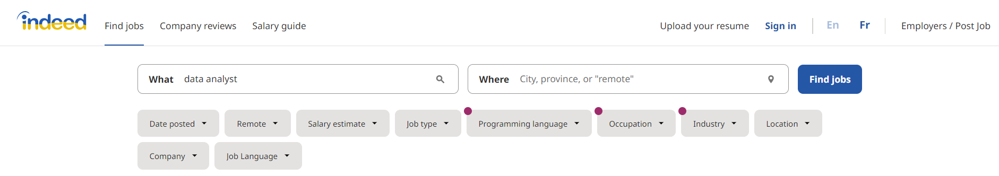
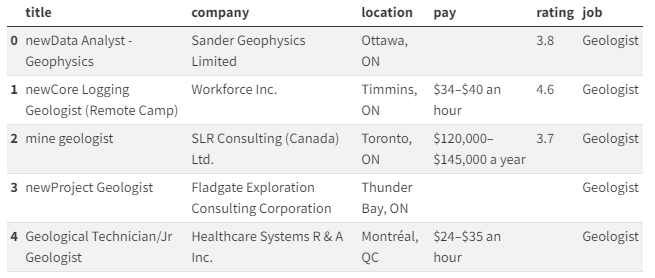
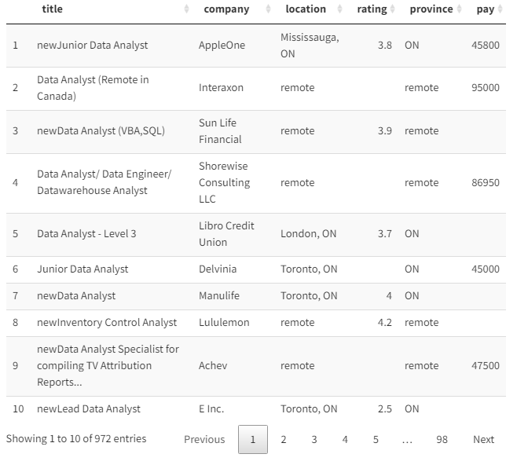
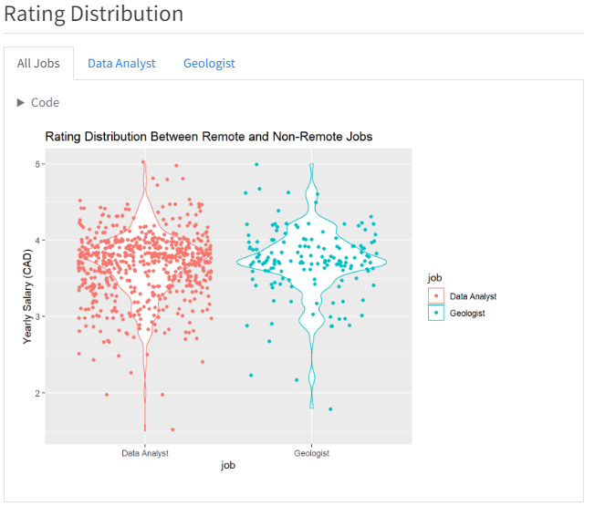
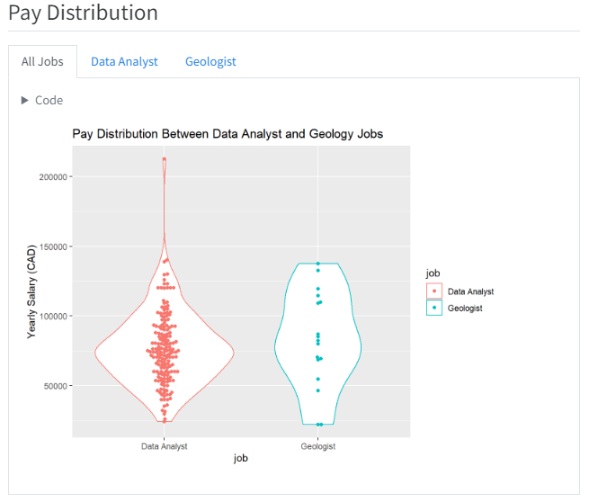
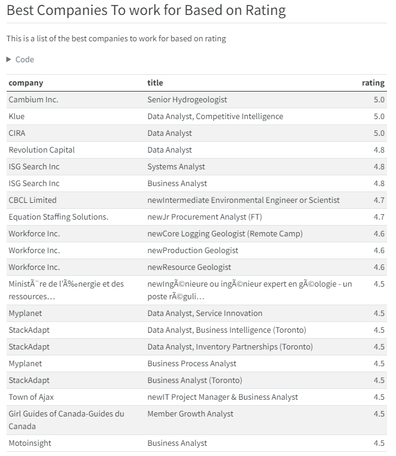

# indeed-job-analysis

[Project Website](https://mitchelljbrown.github.io/indeed-job-analysis/)

## Motivation

Throughout my MSc in Water Resources Engineering I became enthralled by the field of data analytics and data science. My thesis project involved a heavy data analytics component where I have spent countless hours in R analyzing hydrogeologic data. After realizing the endless capabilities of programming languages like R and Python, I quickly became interested in a career in data analytics. Most geoscience disciplines have a large analytical component involving large and complex datasets. As someone who has had ample experience collecting, analyzing and interpreting data, I believe I possess many of the skills necessary to apply for jobs in the data analytics field. 

One of the things I have contemplated is how do the job opportunities for geoscientists differ from data analysts? To answer this question, I developed a strategy and created this website to showcase it.

### Scraping

I wrote a generic scraping function in python to scrape every record from a search in indeed.com given a specific search criteria. I scraped data for data analyst positions and geoscience positions and stored them in the same .csv file. Here is what the data looked like after scraping:

### Cleaning

After the data was collected. It needed to be cleaned to be used to gain the desired insights. To do this, I heavily relied on the data.table package in R. The most challanging aspect of cleaning was parsing the pay column strings to collect salary information. Here is what the data looked like after cleaning:

### Gaining Insight

Now that the data is ready to be used for analysis. I made thorough comparisons regarding job availability, remote work, salary expectations and location distribution. I also created tables showcasing the best companies to work for in each industry based on salary expectations and company reviews.

